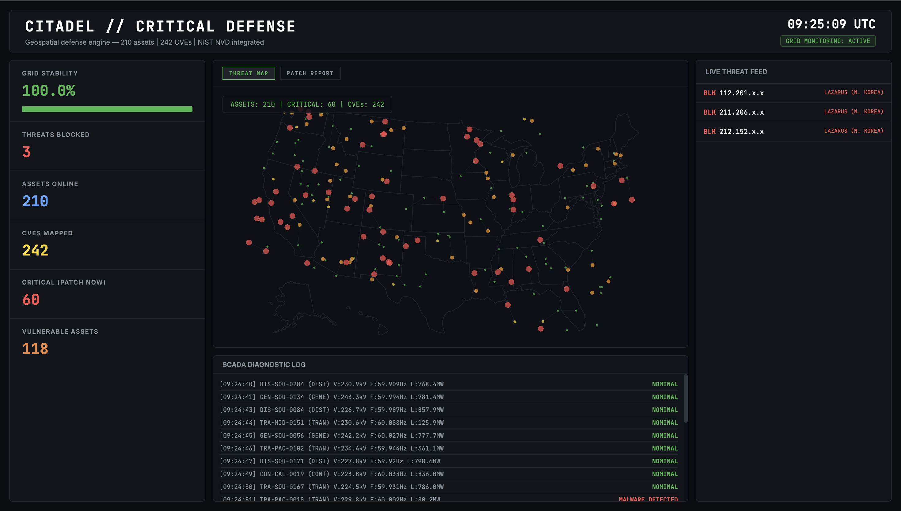

# Citadel: Critical Infrastructure Vulnerability Scanner

An automated simulation engine for assessing industrial network vulnerabilities. Utilizes a geospatial defense pipeline to map high-velocity threat vectors and maintain grid stability through real-time SCADA telemetry analysis and firewall intercepts.

## Dashboard Preview

## Technical Stack
- **Language:** Python 3.10+
- **Framework:** Plotly Dash (Geospatial Visualization)
- **Data Processing:** Pandas, NetworkX (Graph Theory Logic)
- **Data Source:** Simulated SCADA Telemetry & NIST NVD Threat Models

## Core Functionality
- **Geospatial Surveillance:** Real-time visualization of critical generation and transmission nodes across the Western Interconnection.
- **Threat Neutralization:** A rule-based engine that flags and blocks malicious signatures from known APT groups (e.g., Lazarus, Sandworm).
- **Dynamic Stability Metrics:** A live status feed that calculates grid integrity percentages based on the frequency of neutralized attacks.

## How to Run
1. Clone the repository: `git clone https://github.com/Kenneth-Thakur/Citadel-Scanner.git`
2. Install dependencies: `pip install -r requirements.txt`
3. Run the application: `python citadel.py`
