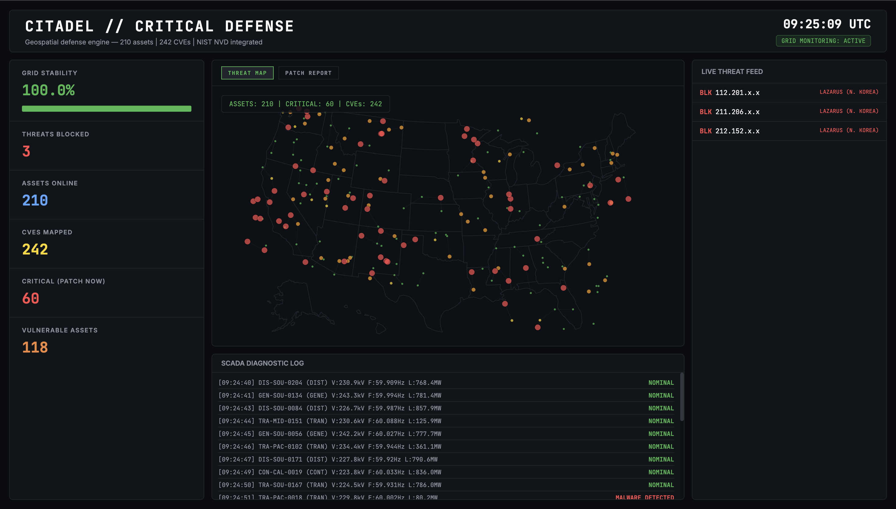

# Citadel: Critical Infrastructure Vulnerability Scanner

A geospatial defense engine that simulates 210 SCADA assets, fetches real CVEs from NIST NVD, and prioritizes patching by CVSS severity.

## Dashboard Preview

## Technical Stack
- **Language:** Python 3.10+
- **Framework:** Plotly Dash (Geospatial Visualization)
- **Data Processing:** Pandas
- **Data Source:** Simulated SCADA Telemetry & NIST NVD Threat Models

## Core Functionality
- **Geospatial Surveillance:** Real-time map of 210 SCADA assets across 8 US regions, colored by patch priority.
- **Threat Neutralization:** A rule-based engine that flags and blocks malicious signatures from known APT groups (e.g., Lazarus, Sandworm).
- **Dynamic Stability Metrics:** Live grid stability tracking that responds to simulated threat events.

## How to Run
1. Clone the repository: `git clone https://github.com/Kenneth-Thakur/Citadel-Scanner.git`
2. Install dependencies: `pip install -r requirements.txt`
3. Run the application: `python citadel.py`
